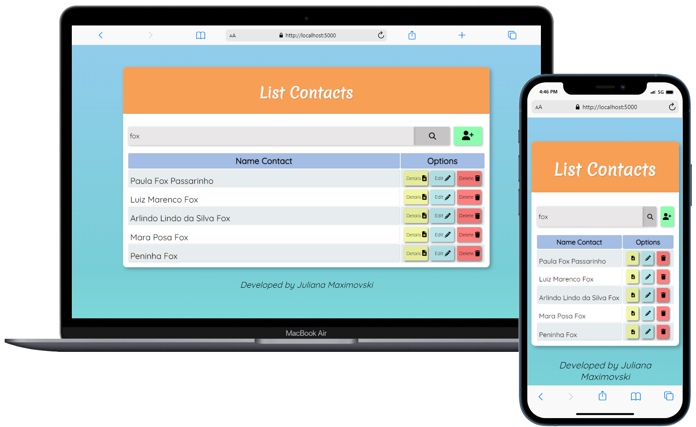
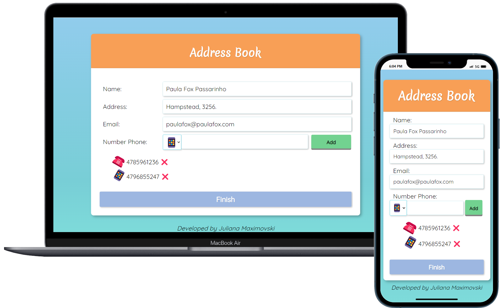

# My First Full-Stack Project!

My purpose with this project was to develop a **Full-Stack** application to manage contacts.

I applied my learnings obtained over the last months in **C#, SQL, HTTP API, JSON** and my **HTML, CSS, JavaScript** learnings from [*Curso em Video*](https://www.youtube.com/@CursoemVideo). 

For that, I used my previous code called [*Address-Book*](https://github.com/JuMaxi/Addres-Book.SQL) and created a fully responsive front-end interface that communicates with the back-end over HTTP requests.

Filtering and searching capabilities were also added.

